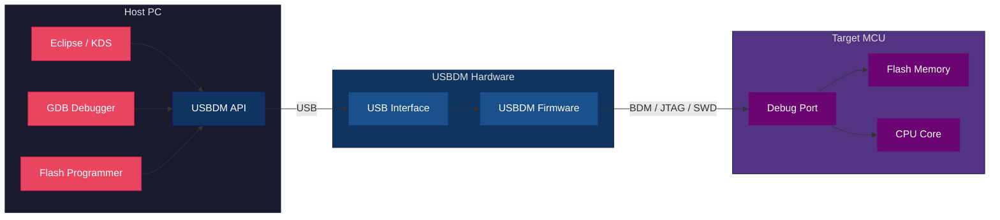
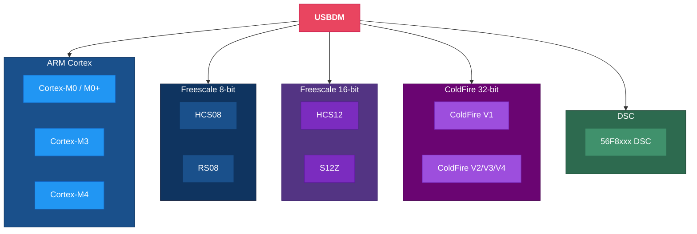

# USBDM - Universal Serial BDM Debugger

**USBDM** is an open-source hardware debugger and flash programmer for Freescale/NXP microcontrollers. It provides a complete toolchain for programming, debugging, and developing firmware across a wide range of embedded target architectures via USB.

> **Original author:** Peter O'Donoghue ([podonoghue](https://github.com/podonoghue/usbdm-eclipse-makefiles-build)) - all credit for the design and development of USBDM belongs to him.
>
> This fork adds aarch64 (ARM64) support and packaging. Please refer to the [upstream repository](https://github.com/podonoghue/usbdm-eclipse-makefiles-build) for the canonical source.

> **Version:** 4.12.1 | **License:** GPL | **Platform:** Linux (x86_64, aarch64), Windows (32/64-bit)

---

## Overview



---

## Supported Target Architectures



**Target families include:** Kinetis (NXP), STM32 (ST), LPC (NXP), ColdFire, HCS08/12, RS08, S12Z, and 56F8xxx DSC series.

---

## Debug Protocols

| Protocol | Targets | Description |
|----------|---------|-------------|
| **BDM** | HCS08, HCS12, RS08, ColdFire V1, DSC | Background Debug Mode - single-wire debug |
| **JTAG** | ColdFire Vx, ARM, generic | IEEE 1149.1 standard test/debug interface |
| **SWD** | ARM Cortex, S12Z | Serial Wire Debug - 2-wire ARM debug |

---

## Software Architecture

```mermaid
graph TB
    subgraph APPS["Applications"]
        direction LR
        PROG["Flash Programmer<br/><i>wxWidgets GUI</i>"]
        GDBSRV["GDB Server<br/><i>Remote Debug</i>"]
        FWCHG["Firmware Changer"]
        KBOOT["Kinetis Bootloader"]
        KUNLK["Kinetis Unlock"]
        MDUMP["Memory Dump"]
    end

    subgraph PLUGINS["Plugin / Binding Layer"]
        direction LR
        WX["UsbdmWx<br/><i>wxWidgets UI</i>"]
        TCL["UsbdmTcl<br/><i>Tcl Scripting</i>"]
        JNI["UsbdmJni<br/><i>Java / JNI</i>"]
        GDI["GDI<br/><i>CodeWarrior</i>"]
        LEGACY["Legacy API"]
    end

    subgraph CORE["Core Libraries"]
        direction LR
        PROGDLL["Programmer DLL<br/><i>Flash Algorithms</i>"]
        BDM["BdmInterface DLL<br/><i>Protocol Layer</i>"]
        DEVDB["Device Database<br/><i>XML Definitions</i>"]
        FIMG["FlashImage DLL<br/><i>Image Handling</i>"]
    end

    subgraph SYSTEM["System Layer"]
        direction LR
        USBDM_DLL["Usbdm DLL<br/><i>USB Communication</i>"]
        SYS["UsbdmSystem DLL<br/><i>Logging / Utilities</i>"]
    end

    subgraph EXTERN["External Dependencies"]
        direction LR
        LIBUSB["libusb-1.0"]
        WXLIB["wxWidgets 3.x"]
        XERCES["Xerces-C XML"]
        TCLLIB["Tcl 8.6"]
    end

    APPS --> PLUGINS
    APPS --> CORE
    PLUGINS --> CORE
    CORE --> SYSTEM
    SYSTEM --> EXTERN

    style APPS fill:#e94560,stroke:#c81d4e,color:#fff
    style PLUGINS fill:#f7a440,stroke:#e08830,color:#1a1a2e
    style CORE fill:#0f3460,stroke:#16213e,color:#fff
    style SYSTEM fill:#533483,stroke:#3d1f6e,color:#fff
    style EXTERN fill:#2d6a4f,stroke:#1b4332,color:#fff

    style PROG fill:#ff6b6b,stroke:#ee5a5a,color:#fff
    style GDBSRV fill:#ff6b6b,stroke:#ee5a5a,color:#fff
    style FWCHG fill:#ff6b6b,stroke:#ee5a5a,color:#fff
    style KBOOT fill:#ff6b6b,stroke:#ee5a5a,color:#fff
    style KUNLK fill:#ff6b6b,stroke:#ee5a5a,color:#fff
    style MDUMP fill:#ff6b6b,stroke:#ee5a5a,color:#fff

    style WX fill:#ffb347,stroke:#f0a030,color:#1a1a2e
    style TCL fill:#ffb347,stroke:#f0a030,color:#1a1a2e
    style JNI fill:#ffb347,stroke:#f0a030,color:#1a1a2e
    style GDI fill:#ffb347,stroke:#f0a030,color:#1a1a2e
    style LEGACY fill:#ffb347,stroke:#f0a030,color:#1a1a2e

    style PROGDLL fill:#1a508b,stroke:#0f3460,color:#fff
    style BDM fill:#1a508b,stroke:#0f3460,color:#fff
    style DEVDB fill:#1a508b,stroke:#0f3460,color:#fff
    style FIMG fill:#1a508b,stroke:#0f3460,color:#fff

    style USBDM_DLL fill:#7b2cbf,stroke:#5a189a,color:#fff
    style SYS fill:#7b2cbf,stroke:#5a189a,color:#fff

    style LIBUSB fill:#40916c,stroke:#2d6a4f,color:#fff
    style WXLIB fill:#40916c,stroke:#2d6a4f,color:#fff
    style XERCES fill:#40916c,stroke:#2d6a4f,color:#fff
    style TCLLIB fill:#40916c,stroke:#2d6a4f,color:#fff
```



---

## Flash Programming Flow

```mermaid
sequenceDiagram
    participant User
    participant Programmer as Flash Programmer
    participant DevDB as Device Database
    participant BDM as BDM Interface
    participant HW as USBDM Hardware
    participant MCU as Target MCU

    User->>Programmer: Select device & image file
    Programmer->>DevDB: Load device definition (XML)
    DevDB-->>Programmer: Memory map, flash params, TCL scripts

    Programmer->>BDM: Connect to target
    BDM->>HW: USB command
    HW->>MCU: BDM/JTAG/SWD handshake
    MCU-->>HW: Target identified
    HW-->>BDM: Connection confirmed
    BDM-->>Programmer: Ready

    rect rgb(15, 52, 96)
        Note over Programmer,MCU: Flash Programming Sequence
        Programmer->>BDM: Mass erase / sector erase
        BDM->>HW: Erase command
        HW->>MCU: Execute erase
        MCU-->>HW: Erase complete

        Programmer->>BDM: Program flash blocks
        BDM->>HW: Write data
        HW->>MCU: Flash write
        MCU-->>HW: Write complete

        Programmer->>BDM: Verify programmed data
        BDM->>HW: Read back
        HW->>MCU: Memory read
        MCU-->>HW: Data
    end

    HW-->>Programmer: Verification passed
    Programmer-->>User: Programming complete
```



---

## Repository Structure

```
USBDM/
├── Shared/                    # Core headers & shared source (USBDM_API.h)
├── Usbdm_DLL/                # Main USB communication library
├── UsbdmSystem_DLL/           # System utilities and logging
├── BdmInterface_DLL/          # Debug protocol implementations (BDM/JTAG/SWD)
├── DeviceDatabase_DLL/        # XML device database parser
├── FlashImage_DLL/            # Flash image file handling (S-record, ELF, HEX)
├── Programmer_DLL/            # Flash programming engines (per architecture)
├── Programmer/                # wxWidgets flash programmer GUI
├── GdbServer/                 # GDB remote debug server
├── UsbdmTcl_DLL/             # Tcl scripting interface
├── UsbdmWx_DLL/              # wxWidgets UI plugin
├── UsbdmJni_DLL/             # Java JNI bindings
├── UsbdmDsc_DLL/             # DSC-specific API
├── GDI_DLL/                  # CodeWarrior GDI plugin
├── Legacy_DLL/               # Backwards-compatible API
├── FirmwareChanger/           # BDM firmware update tool
├── JS16_Bootloader/           # JS16 USB bootloader
├── JB16_Bootloader/           # JB16 USB bootloader
├── KinetisBootloader/         # Kinetis USB bootloader
├── KinetisUnlock/             # Kinetis security unlock utility
├── MemoryDump/                # Memory dump utility
├── PackageFiles/
│   ├── DeviceData/            # Device definitions (XML + TCL + flash routines)
│   ├── Stationery/            # Eclipse/IDE project templates & SVD files
│   ├── bin/ lib/              # Distribution binaries
│   ├── MiscellaneousLinux/    # Linux packaging (udev rules, .deb control)
│   └── MiscellaneousWin/      # Windows packaging (WiX installer)
├── Common.mk                  # Shared build configuration
├── Makefile-x64.mk            # 64-bit build entry point
├── MakeAll                    # Top-level build script
└── README.md
```

---

## Building from Source

### Prerequisites

| Dependency | Purpose |
|-----------|---------|
| **GCC/G++** (C++17) | Compiler |
| **libusb-1.0-dev** | USB communication |
| **libwxgtk3.0-gtk3-dev** | GUI toolkit |
| **libxerces-c-dev** | XML parsing |
| **tcl8.6-dev** | Scripting engine |

### Linux

```bash
# Clone
git clone https://github.com/paul-jvb/usbdm-eclipse-makefiles-build.git
cd usbdm-eclipse-makefiles-build

# Install dependencies (Debian/Ubuntu)
sudo ./LinuxPackages

# Build all components
./MakeAll

# Create .deb package and install
./CreateDebFile
sudo ./Update
```

### Windows (MSYS2/MinGW)

```bash
# See Installing MSYS2.txt for required packages
./MakeAll    # from MSYS2 shell
```

### Linux (aarch64 / Raspberry Pi)

```bash
# Install dependencies
sudo apt install libusb-1.0-0-dev libwxgtk3.2-dev tcl8.6-dev libxerces-c-dev

# Build
./MakeAll

# Package
./CreateDebFile
sudo dpkg -i <generated .deb>
```

---

## Key Features

- **Multi-architecture** - Single tool supporting 8+ MCU families
- **GDB integration** - Full remote debugging via GDB server
- **TCL scripting** - Customisable flash programming and device init scripts
- **Comprehensive device database** - XML definitions for hundreds of MCU variants
- **Eclipse integration** - Plugin support for Eclipse CDT and Kinetis Design Studio
- **Cross-platform** - Linux (x86_64, aarch64) and Windows (32/64-bit)
- **Multiple debug protocols** - BDM, JTAG, and SWD from a single adapter
- **Bootloader support** - USB-based field firmware updates (JB16, JS16, Kinetis)

---

## Credits

USBDM was created by **Peter O'Donoghue**. This repository is a fork that adds aarch64/ARM64 Linux support.

- **Upstream repository:** https://github.com/podonoghue/usbdm-eclipse-makefiles-build
- **Release files:** http://sourceforge.net/projects/usbdm/files/
- **Documentation:** http://usbdm.sourceforge.net/
- **This fork:** https://github.com/paul-jvb/usbdm-eclipse-makefiles-build
